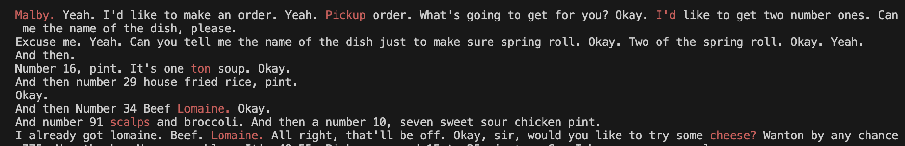

# Real-Time LLM Spell Checker

### Overview
This script integrates a LLM into the AssemblyAI Real-Time API to correct spelling errors in real-time. The script is currently configured to correct dish names for an online food ordering service.

### Steps
1. Install the required packages in requirements.txt
2. Create a .env file with your `OPENAI_API_KEY` and `ASSEMBLYAI_API_KEY`
2. Transcode the files you want to transcribe (requires FFMPEG)
3. Add your menu items to menu.txt
4. Run the script `python transcript.py <audio_file_path>`

### Files
1. **transcript.py:** Creates websocket and streams audio to AssemblyAI API.
2. **llm.py:** Makes call to LLM and returns corrected utterance.
3. **transcode.py:** Transcodes audio files to the required PCM 16bit format.
4. **menu.txt:** List of menu items to use as reference for LLM.

### Notes
[1] This script uses our Real-Time confidence scoring to identify the potential misspellings. Ironically this aligns pretty well with the dish names that are being mis-transcribed (the words in red in the screenshot below all have confidence scores below 0.5)

[2] Using an LLM, we can try to correct these misspellings in real-time. We can provide the LLM the correct spellings of the dish names as reference.

[3] Overall, this solution would be fairly cheap to implement. For example I used GPT 3.5 Turbo in the demo below and averaged the total cost out to be ~$0.0008 per 2 minute call. To save on cost / latency, we only make the LLM call if a low-confidence word is detected in the utterance. So essentially the LLM is only used as backup and can be toggled on or off depending on restaurant / cuisine (customer mentioned Chinese & Japanese dishes were the most difficult to transcribe)

[4] Latency may be a slight concern here. Depending on OpenAI's system traffic levels, the LLM call can take anywhere from 1-5 seconds to return the corrected utterance. IMO, this added latency worth it if it fixes the downstream dish detection issue. I have a few ideas on ways we can try to reduce this including fine-tuning a smaller model (davinci-003) or combining the spell correction + dish detection NER processes. Sadly, LeMUR won't be a viable option here as the latency is just too long to be used in a Real-Time setting.

### Demo
https://github.com/AssemblyAI-Solutions/RealtimeSpellCheck/assets/106788596/83df6f05-ece4-49ba-839d-d79022aafe93

